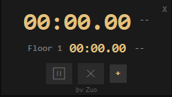
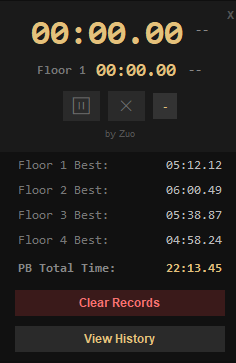
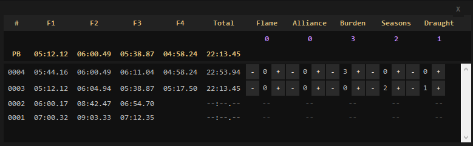

# Zarokh User Guide

A complete walkthrough of everything Zarokh does. For installation
instructions, see the main [README](../README.md).

## The main window

A small, borderless, always-on-top window you can drag anywhere on
screen by clicking and holding it.

- **Global clock**: total elapsed time for the current run, with a
  delta (in seconds) against your best total time to its right —
  green if you're currently faster than your record, red if slower.
- **Floor clock**: elapsed time for the current floor only, smaller
  than the global clock, with its own delta against that floor's
  record, using the same color rule. A `Floor N` label shows which
  floor is currently being tracked.
- Both clocks show `00:00.00` and the deltas show `--` until a run
  actually starts — either when you enter Sekhemas' first floor, or
  right after the app launches.

### Controls

Two small icon buttons, enabled only while a run is in progress:

- **Pause / Restart** (⏸ / ▶): pauses the clocks in place, or
  resumes them exactly where they left off. Hover over the button to
  see which action it will perform next.
- **Cancel** (✕): abandons the current run entirely. The clocks stop
  and the run is logged to history as cancelled — no total time and
  no relic tracking for it, since Zarokh was never actually killed.

If you pause and then clear a floor without hitting Restart first,
Zarokh assumes you forgot — the run is automatically cancelled, the
same as pressing Cancel yourself.

### The "+" panel

Click **+** to expand a hidden panel below the controls:

- Your best time for each floor and your best total time.
- **Clear Records** — resets your best times back to empty.
  ⚠️ This does *not* delete your run history, only your personal
  bests.
- **View History** — opens the run history window (see below).
- A small **by Zuo** credit link at the bottom, opening the project's
  GitHub page.

## The run history window

Opened via **View History**. Unlike the main window, this one is a
normal window — it can go behind other windows, and it shows up in
the taskbar and Alt+Tab if you need to bring it back.

Two rows are always pinned at the top, regardless of scrolling:

1. **Relic totals** — how many of each unique relic you've collected
   across every completed run, all time.
2. **PB (personal best)** — your best time for each floor and for
   the full run, for direct comparison against every row below.

Below that, every run you've ever done is listed, most recent first:

- **#** — the attempt number.
- **F1–F4** — the time for each floor, if it was reached.
- **Total** — the run's total time, or `--:--.--` if the run was
  cancelled before finishing.
- **Relic columns** — for completed runs, use the **+ / -** buttons
  to log how many of each relic dropped (0 or more, no upper limit).
  Cancelled runs show `--` here — there's nothing to log, since
  Zarokh wasn't killed.

## Files Zarokh creates

All created next to `zarokh.exe`:

- `zarokh_data.json` — your best times and full run history
  (including relic counts). If you're upgrading from an older
  version that used `zarokh_records.json`, your data is migrated
  automatically the first time you run the new version.
- `zarokh_config.json` — remembers the location of your `Client.txt`
  so you're not asked for it every time.
- `zarokh.log` — a rotating log (today's and yesterday's activity)
  with diagnostic details. If something isn't working right, this is
  the first thing to check — and the most useful thing to include if
  you report an issue.
